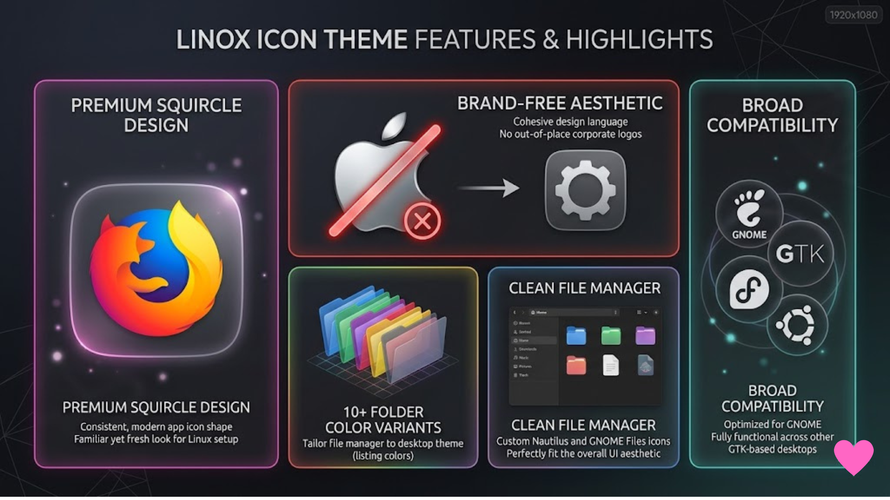

# Linox Icon Theme

Elevate your Linux desktop with Linox—a premium, brand-free squircle icon pack combining the best of macOS aesthetics with native Linux consistency.

# ☕ Support the Development!
If this theme has made your Linux desktop look a little more beautiful, consider buying me a coffee! Building and maintaining pixel-perfect icons takes a lot of time and love. Your support directly fuels new updates, more application icons, and future improvements. Thank you so much! 💖🐧

<a href="https://www.paypal.com/paypalme/abhijeetshewale1947">
  
</a>

**Linox Icon Theme** is a clean, premium, **squircle-based Linux icon theme** designed for modern desktop environments. If you are looking to elevate your desktop customization with a polished, unified aesthetic, Linox delivers a highly consistent experience.

While heavily inspired by the sleek shapes of macOS, this icon pack is intentionally designed to be **brand-free**. It removes all Apple branding, allowing your system to feel uniquely its own rather than a direct clone. It seamlessly integrates into your workflow, providing a beautiful GTK desktop experience across distributions like Fedora, Ubuntu, Arch, and more.

## 📖 Table of Contents
- [Features & Highlights](#-features--highlights)
- [Screenshots](#-screenshots)
- [Installation Guide](#-installation-guide)
- [Roadmap & Availability](#-roadmap--availability)
- [Issues & Contributing](#-issues--contributing)
- [License](#-license)
- [Special Thanks & Sources](#-special-thanks--sources)

## ✨ Features & Highlights
* **Premium Squircle Design:** A consistent, modern app icon shape that brings a familiar yet fresh look to your Linux setup.
* **Brand-Free Aesthetic:** Enjoy a cohesive design language without any out-of-place or mismatched corporate logos.
* **10+ Folder Color Variants:** Tailor your file manager to your exact desktop theme. Includes Blue, Green, Orange, Pink, Purple, Red, Slate, Teal, Yellow, and Yaru variants.
* **Clean File Manager:** Custom Nautilus and GNOME Files icons tailored specifically to fit the overall UI aesthetic perfectly.
* **Broad Compatibility:** Optimized for **GNOME**, but fully functional across other GTK-based desktop environments.

## 📸 Screenshots

### Application Icons


### Features & Highlights


### Folder Color Variants


### App Menu


## 📥 Installation Guide

### Prerequisites
Ensure you have `git` installed on your system to download the repository.

### Install via Terminal Script
To install the Linox icon pack for your current user, simply clone the repository and execute the installation script:

```bash
# Clone the repository
git clone https://github.com/abhijeetshewale05/Linox-Icon-Theme

# Navigate into the directory
cd Linox-Icon-Theme

# Run the installer
./install.sh
```
*(Note: To install system-wide for all users, run `sudo ./install.sh`)*

Once the installation is complete, open **GNOME Tweaks** (or your respective desktop environment's appearance settings) and select "Linox" or one of its color variants to apply the theme.

## 🚀 Roadmap & Availability
* Expanding icon coverage for missing third-party Linux applications.
* Future optimizations and dedicated support for KDE Plasma.
* Upcoming official release and publication on **gnome-look.org** for easier community access and updates.

## 🛠️ Issues & Contributing
Spotted an unthemed icon or a bug? Contributions and icon requests are highly welcome! 
1. Check the [Issues tab](../../issues) to see if it has already been reported.
2. If not, feel free to open a new issue with the application name and its `.desktop` file class name. 
3. Pull requests for new icons or fixes are always appreciated.

## 📝 License
GPL-3.0 - See the [LICENSE](LICENSE) file for details.
[](https://www.gnu.org/licenses/gpl-3.0)

---

## 🤝 Special Thanks & Sources

This project would not be possible without the incredible open-source foundations built by other creators in the Linux ricing community. A massive and sincere thank you to the developers of the following themes, which served as the core inspiration and building blocks for Linox:

* **[MacTahoe Icon Theme](https://github.com/vinceliuice/MacTahoe-icon-theme)** - For the gorgeous scalable app icons and the foundational squircle design.
* **[Hatter Icon Theme](https://github.com/Mibea/Hatter)** - For serving as the highly versatile and organized foundational base for the folders and structures.
* **[Adwaita Icon Theme](https://gitlab.gnome.org/GNOME/adwaita-icon-theme)** - For the classic, reliable GNOME design principles that keep the Linux desktop feeling native.

# ☕ Support the Development!
If this theme has made your Linux desktop look a little more beautiful, consider buying me a coffee! Building and maintaining pixel-perfect icons takes a lot of time and love. Your support directly fuels new updates, more application icons, and future improvements. Thank you so much! 💖🐧

<a href="https://www.paypal.com/paypalme/abhijeetshewale1947">
  
</a>

---
**Keywords:** `linux icon theme` `squircle icons` `gnome customization` `macos inspired` `gtk theme` `desktop ricing` `linux customization` `fedora` `ubuntu` `nautilus theme` `full icon theme`
